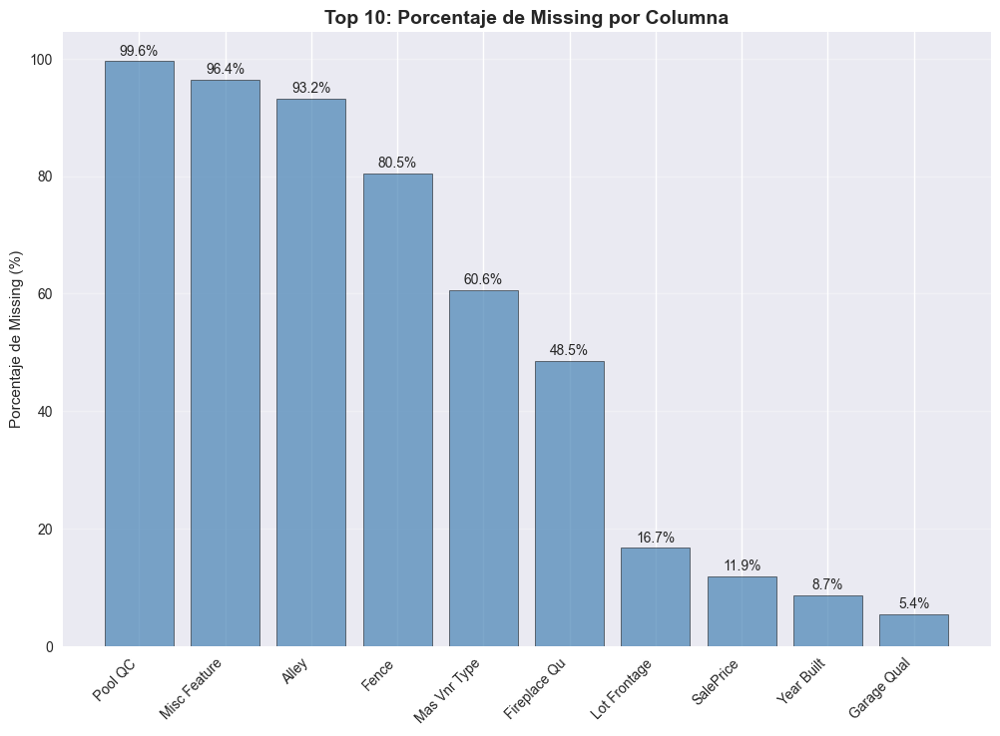
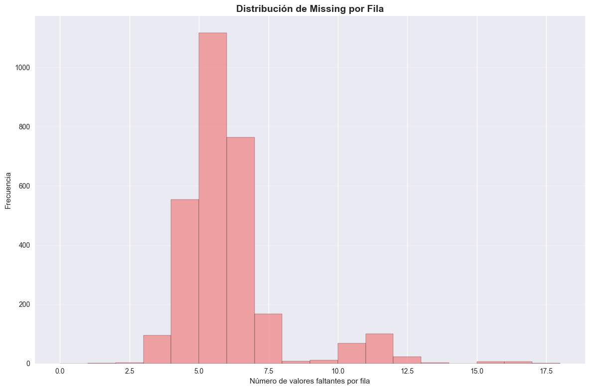
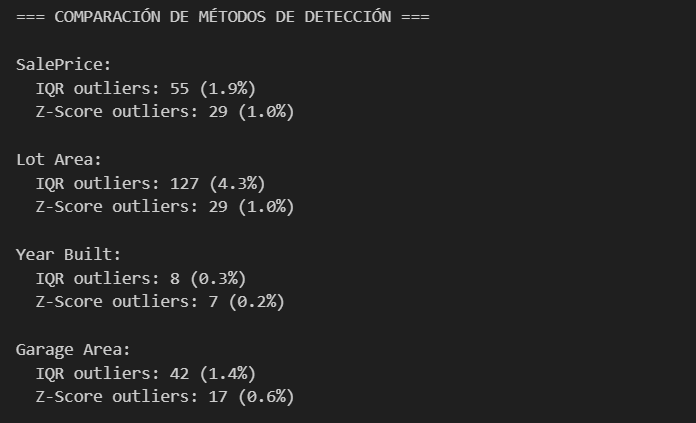
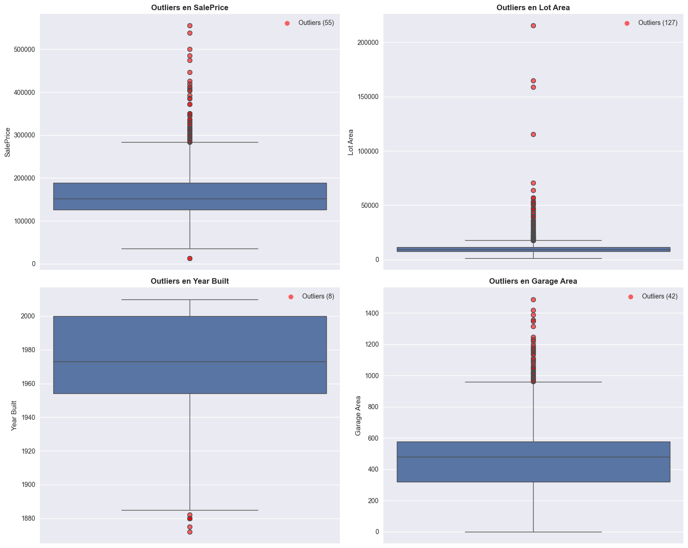
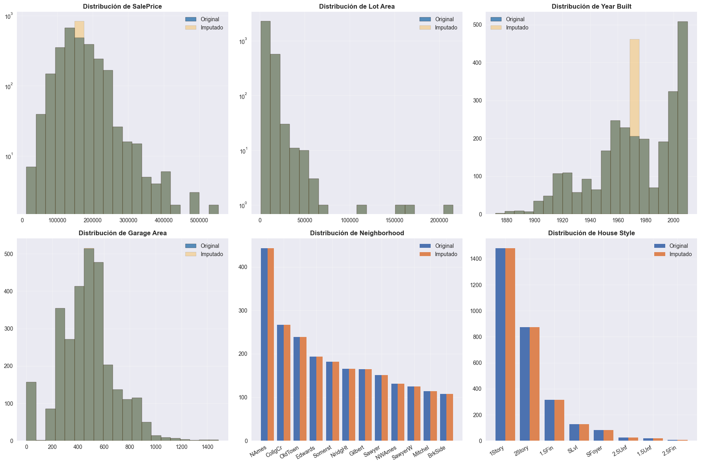
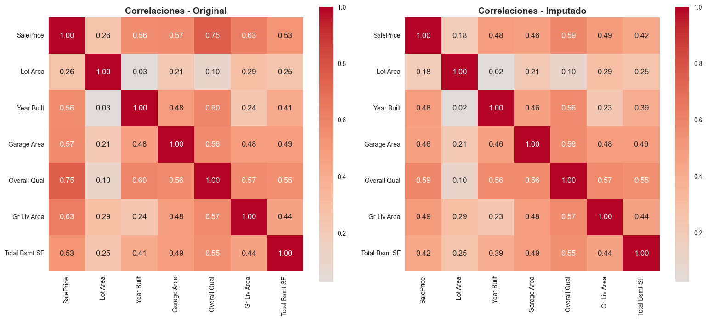

# Exploración de datos faltantes en Ames Housing: patrones y estrategias de imputación

## Contexto
Trabajamos con el dataset Ames Housing (ventas de viviendas en Ames, Iowa), una alternativa moderna al clásico Boston Housing. Incluye variables de propiedad (Lot Area, Year Built, Garage Area), de calidad/condición (Overall Qual, House Style) y el objetivo SalePrice. El foco de esta entrega es entender los tipos de missing, su impacto en el análisis y cómo utilizar datos de forma responsable evitando data leakage.

## Objetivos
- Identificar columnas con mayor porcentaje de valores faltantes y su patrón
- Clasificar tipos de missing y documentar supuestos
- Comparar estrategias de imputación (media/mediana/moda vs. por grupos) sin leakage
- Medir el impacto de la imputación en distribuciones y correlaciones clave

## Actividades (con tiempos estimados)
- Exploración y perfilado de missing: 30 min
- Clasificación de missing values y supuestos: 20 min
- Imputación simple vs. “smart” por grupos: 30 min
- Comparación de distribuciones/correlaciones pre/post: 25 min

## Desarrollo
Se realizó un EDA inicial del dataset (tipos, memoria, nulos, duplicados). Luego, se construyeron vistas de porcentaje de faltantes por columna y distribución de faltantes por fila. Se propusieron hipótesis de tipo de faltante para las columnas numéricas más importantes del dataset.

Para imputación se compararon tres enfoques: media/mediana/moda; imputación por grupos (ej. mediana de Year Built por Neighborhood × House Style); y banderas/valores explícitos para categorías con ausencias semánticas. Se cuidó el anti-leakage: ajuste de imputers sólo en train y aplicación en valid/test.

???+ info "Notas de implementación (resumen reproducible)"
    - Separación train/valid/test antes de imputar
    - Selección de estrategia por tipo de variable y distribución
    - Validación del cambio en correlaciones con SalePrice y entre features

## Evidencias
- Mapa de calor y barras de missing por columna: { width="420" }
- Distribución de missing por fila: { width="420" }
- Comparación de métodos de detección: { width="420" }
- Visualización de outliers: { width="420" }
- Impacto de imputación: { width="420" }
- Impacto de imputación heatmap correlaciones: { width="420" }

## Reflexión
La imputación “rápida” puede distorsionar relaciones importantes, por eso documentar supuestos y medir efectos es importante. El anti-leakage es impreciendible para asegurar la calidad de los resultados y evitar el overfitting.

## Referencias
- Kaggle: Ames Housing dataset (versión tabular pública)
- Documentación de pandas, seaborn y scikit-learn (SimpleImputer, Pipeline, ColumnTransformer)
