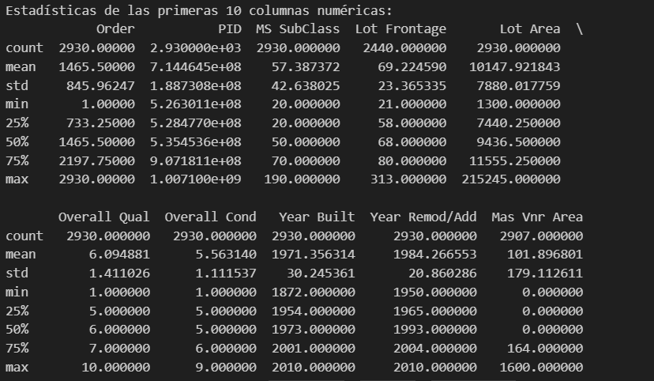
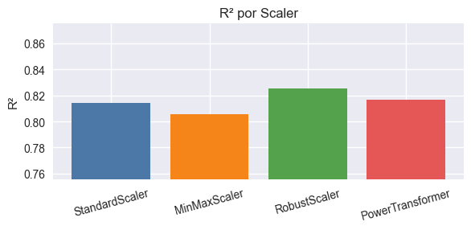
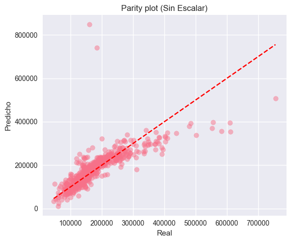

# Outliers y escalado en Ames Housing: cómo cambia la detección según el orden del pipeline

## Contexto
Continuamos con Ames Housing para estudiar dos temas críticos del preprocesamiento: detección de outliers (IQR y Z-score) y técnicas de escalado (Standard, MinMax, Robust).

## Objetivos
- Comparar IQR vs. Z-score en datos originales y escalados
- Evaluar Standard/MinMax/Robust y su impacto en outliers
- Investigar transformaciones logarítmicas para variables sesgadas
- Documentar un pipeline anti-leakage reproducible

## Actividades (con tiempos estimados)
- Detección base de outliers y métricas: 25 min
- Escalado con 3 técnicas y re-detección: 30 min
- Log transform seguro y comparación de skew: 20 min
- Redacción de conclusiones y recomendación: 15 min

## Desarrollo
Se seleccionaron variables numéricas con escalas muy distintas (p.ej., SalePrice, Lot Area, Gr Liv Area). Se detectaron outliers con IQR y Z-score, se aplicaron StandardScaler, MinMaxScaler y RobustScaler y se repitió el conteo/comparación.

??? info "Hallazgos clave"
    - RobustScaler mostró la mayor robustez a extremos, cambiando menos la detección por IQR
    - Log transform redujo skew y outliers en variables fuertemente sesgadas
    - Confirmado: detectar y tratar outliers ANTES del escalado evita que la escala enmascare extremos

## Evidencias
- Estadísticas de columnas numéricas { width="420" }
- R2 por scaler { width="420" }
- Plot de predicciones del modelo { width="420" }

## Reflexión
El orden del pipeline importa: sugerencia general Log → Outliers → Scale, validando con CV y evitando leakage. La comparación mostró que algunas instancias dejan de ser marcadas como outliers tras escalar, lo que podría ocultar problemas de calidad si no se analizan previamente.

## Referencias
- Scikit-learn: StandardScaler, MinMaxScaler, RobustScaler, PowerTransformer
- Estadística práctica de outliers (IQR, reglas de 3σ)
