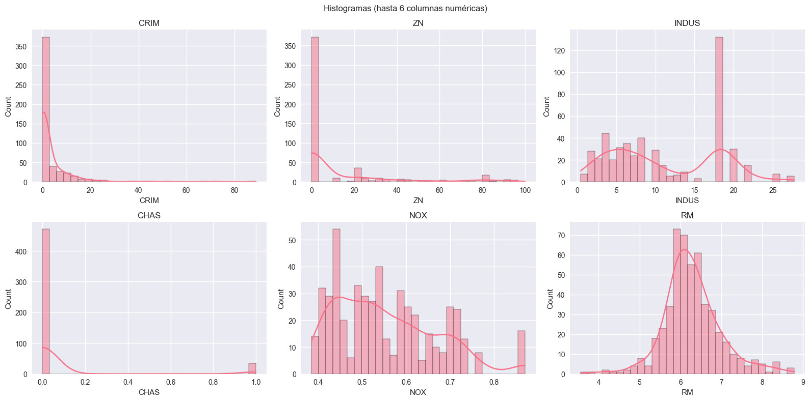
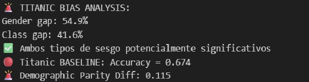
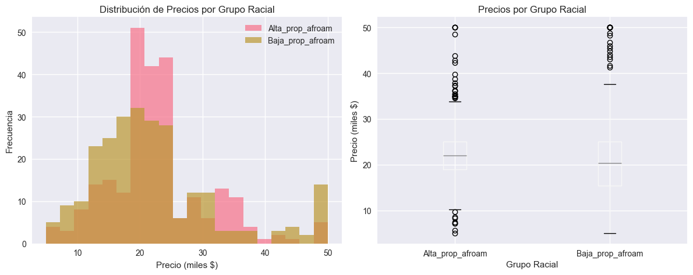
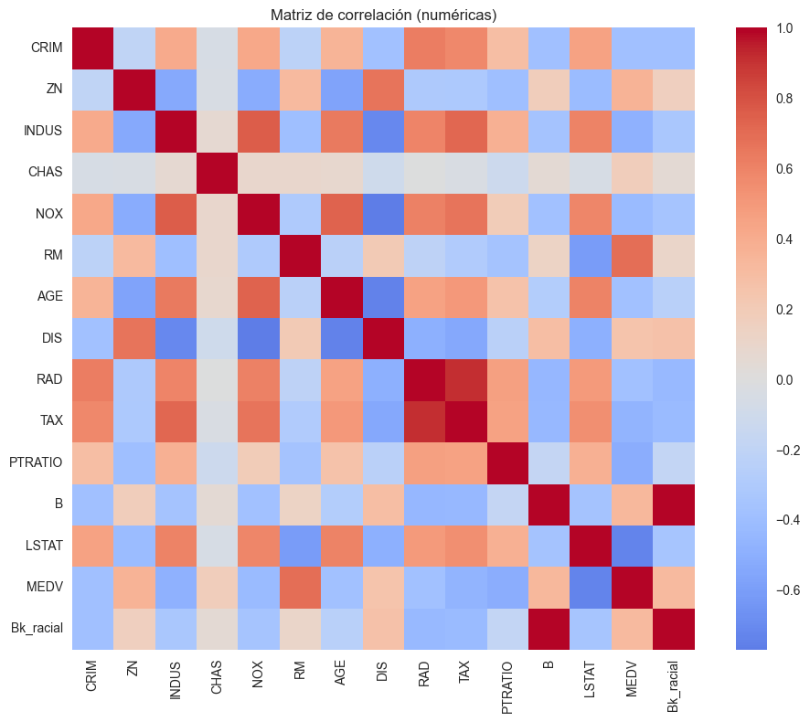

# Fairness en ML con Fairlearn: de la detección a la mitigación del sesgo

## Contexto
Exploramos sesgos en dos datasets clásicos: Boston Housing (variable B con componente racial histórico) y Titanic (sesgo por género y clase). El objetivo es diagnosticar el sesgo, cuantificar su impacto en métricas y aplicar técnicas de mitigación con Fairlearn, entendiendo trade-offs entre desempeño y equidad.

## Objetivos
- Diagnosticar sesgo en variables sensibles o proxies problemáticos
- Medir disparidades (demographic parity, equalized odds) por subgrupos
- Aplicar reducción por restricciones (ExponentiatedGradient + DemographicParity)
- Documentar reflexiones y criterios éticos de uso en producción

## Actividades (con tiempos estimados)
- Boston: carga, reconstrucción de variable Bk y análisis sin corrección: 30 min
- Titanic: baseline, métricas de equidad y mitigación con Fairlearn: 35 min
- Análisis de trade-off accuracy vs. fairness y reflexión ética: 20 min

## Desarrollo
En Boston, se reconstruyó el proxy racial Bk a partir de B y se cuantificó su correlación con precio (MEDV), mostrando brechas sistemáticas entre grupos. Se evitó “corregir” para no maquillar un sesgo histórico; el punto fue visibilizar y documentar.

En Titanic, se entrenó un modelo baseline y se midió Demographic Parity Difference por sexo. Con ExponentiatedGradient y la restricción DemographicParity, se obtuvo un modelo con menor disparidad a costa de una caída contenida de accuracy. Se elaboró un cuadro de trade-off y una recomendación de despliegue responsable.

## Evidencias
- Análisis de variables { width="420" }
- Análisis de bias titanic: { width="420" }
- Visualización de bias titanic: { width="420" }
- Correlación de variables: { width="420" }

## Reflexión
No toda corrección automática es apropiada. En problemas con sesgos históricos (Boston), la transparencia y la exclusión de variables problemáticas son preferibles. En clasificación (Titanic), la mitigación puede ser útil si el costo en desempeño es acotado y está justificado por el impacto social. Toda decisión debe quedar documentada en términos de propósito, riesgos y grupos afectados.

## Referencias
- Fairlearn: MetricFrame, ExponentiatedGradient, DemographicParity
- Notas de ética de datos y guías de despliegue responsable
