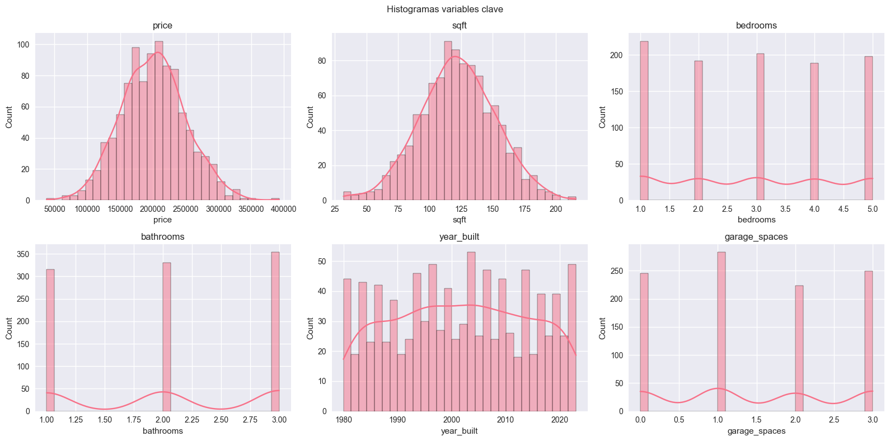
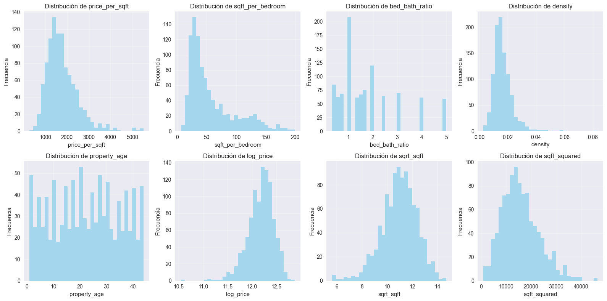
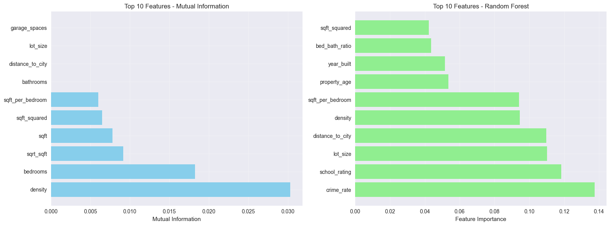

# Crear y evaluar features para predecir precios de viviendas

## Contexto
Se parte de un dataset sintético de inmuebles y una muestra pequeña de Ames Housing para practicar el diseño de features: ratios, transformaciones, variables temporales y compuestas. El objetivo es enriquecer el dataset con información de dominio y evaluar la relevancia de cada feature para predecir precio.

## Objetivos
- Generar features derivadas útiles (ratios, log, interacciones)
- Visualizar distribuciones y detectar outliers de las nuevas variables
- Evaluar importancia con Mutual Information y Random Forest
- Extraer lecciones transferibles a datasets reales (Ames)

## Actividades (con tiempos estimados)
- Diseño de features: 30 min
- Análisis de distribución y outliers: 20 min
- Ranking de importancia (MI + RF) y comparación: 25 min
- Aplicación rápida a muestra de Ames y discusión: 15 min

## Desarrollo
Se creó un set de features de dominio como price_per_sqft, sqft_per_bedroom, property_age, indicadores de calidad y scores compuestos de ubicación/eficiencia. Se revisaron sus distribuciones e outliers y se comparó su información con el target por dos vías: MI y feature_importances_ de un Random Forest. Se graficaron los Top 10 por método para contrastar criterios.

## Evidencias
- Visualización de varialbes principales del dataset { width="420" }
- Análisis de features creadas { width="420" }
- Análisis de importancia de features { width="420" }

## Reflexión
Para cada dataset que se trabaje, es importante análizar el contexto y todas sus avriables en detenimiento para poder crear features que mejor reflejen la realidad impactando positivamente en el modelo entrenado. El análisis estadístico y transfromación de las variables es útil para sumar accuracy pero donde mas se gana es generando features creativas que reflejen la realidad del problema analizado.

## Referencias
- Scikit-learn: mutual_info_regression, RandomForestRegressor
- Prácticas de feature engineering en problemas tabulares
