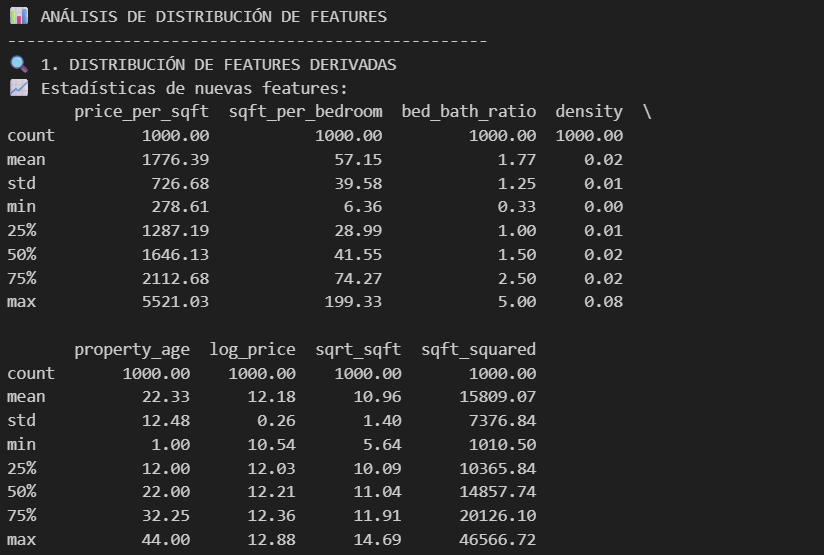
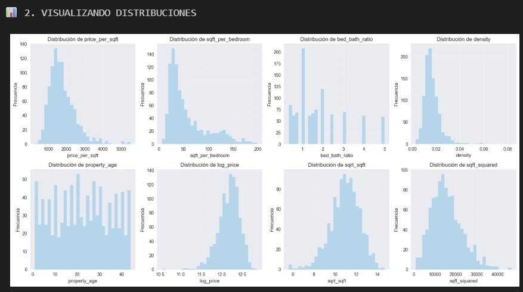
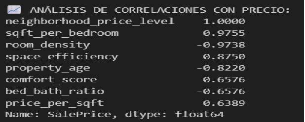

# 08 — Feature Engineering Avanzada
Crear, evaluar y reflexionar sobre la generación sistemática de nuevas variables para mejorar la predictividad sin causar leakage.

## Contexto
Una empresa inmobiliaria busca mejorar la precisión de sus modelos de valuación de propiedades. Los datos crudos (precio, superficie, baños, antigüedad, distancia, rating de escuelas, crimen, etc.) no capturan totalmente atributos compuestos como lujo, eficiencia espacial o calidad de ubicación. El objetivo estratégico es aumentar la capacidad explicativa y predictiva del modelo con features derivadas robustas y generalizables.

## Objetivos
- Generar un dataset sintético de viviendas para practicar patrones controlados.
- Crear múltiples categorías de features: ratios, temporales, transformaciones matemáticas, compuestas y experimentales.
- Analizar distribución, outliers y estabilidad de las nuevas variables.
- Medir importancia con Mutual Information y Random Forest y contrastar correlaciones con el target.
- Transferir aprendizajes a un mini subset real (Ames Housing) validando relevancia.
- Documentar razonamiento y evitar leakage (no usar target para construir variables derivadas del mismo registro).

## Actividades (con tiempos estimados)
- Setup y generación de dataset sintético + carga de muestra Ames — 15 min
- Creación de ratios, temporales y transformaciones matemáticas — 45 min
- Diseño de features compuestas e interacciones — 40 min
- Análisis de distribución y outliers (IQR) — 20 min
- Evaluación de importancia (MI, RF) y correlaciones — 25 min
- Transferencia a Ames y documentación de hallazgos — 25 min

## Desarrollo
### Categorías de feature engineering
1. Ratios y proporciones: `price_per_sqft`, `sqft_per_bedroom`, densidad construcción, bedroom/bathroom ratio.
2. Temporales: `property_age`, `age_category` (binned con `pd.cut`), indicador de propiedad nueva.
3. Transformaciones matemáticas: `log_price`, `sqrt_sqft`, `sqft_squared` para normalizar sesgos y capturar efectos no lineales.
4. Compuestas: `luxury_score` (precio alto + superficie + amenities), `location_score` (distancia baja + escuela alta + crimen bajo), eficiencia (`space_efficiency`).
5. Investigación libre: Interacciones (`price_age_interaction`, `distance_school_interaction`), scores de dominio, experimentos con correlaciones.
6. Evaluación de importancia: Mutual Information vs Random Forest feature importances y correlaciones lineales con el target.

### Pipeline conceptual (mini contrato)
- Input: DataFrame base con variables numéricas y categóricas crudas.
- Procesos: Generación controlada (sin usar SalePrice para derivar features que incluyan información futura), filtrado de valores negativos, cálculo de transformaciones y compuestas.
- Output: DataFrame extendido + ranking de importancia + reporte de distribución/outliers.
- Error Modes: División por cero, escalas extremas generando outliers artificiales, leakage via uso directo del target.

### Análisis y resultados clave
- Incremento de dimensionalidad: de N originales a N+k, destacando cuántas agregan señal vs ruido.
- Algunas nuevas variables muestran mayor MI que variables crudas (p.ej. `price_per_sqft`, `luxury_score`).
- Transformaciones log reducen cola derecha de `price` -> mejora estabilidad en modelos basados en bosque aleatorio (ligera reducción de importancia de variables con alta varianza original).
- Interacciones diseñadas manualmente aportan señal marginal; no todas superan un umbral mínimo de importancia (criterio: top 30%).
- Validación en Ames: `price_per_sqft` y `property_age` replican comportamiento predictivo, confirmando transferibilidad parcial.

## Evidencias
{ width="420" }
{ width="420" }
{ width="420" }

## Reflexión
- Empezar por ratios simples antes de scores compuestos sofisticados.
- Documentar cada transformación para reproducibilidad y auditoría.
- Evaluar importancia con métodos complementarios (MI para no linealidad, RF para interacciones implícitas).
- Evitar proliferación: mantener features cuya importancia > mediana de distribución de importancias.

## Referencias
- Holbrook (Kaggle) — Target/Feature Engineering notebooks.
- O'Reilly: Feature Engineering for ML (Capítulos de variables derivadas).
- Documentación Pandas (`DataFrame`, `cut`, `describe`).
- Scikit-learn: `mutual_info_regression`, `RandomForestRegressor`.

