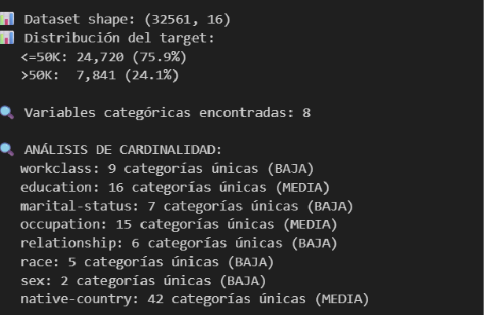
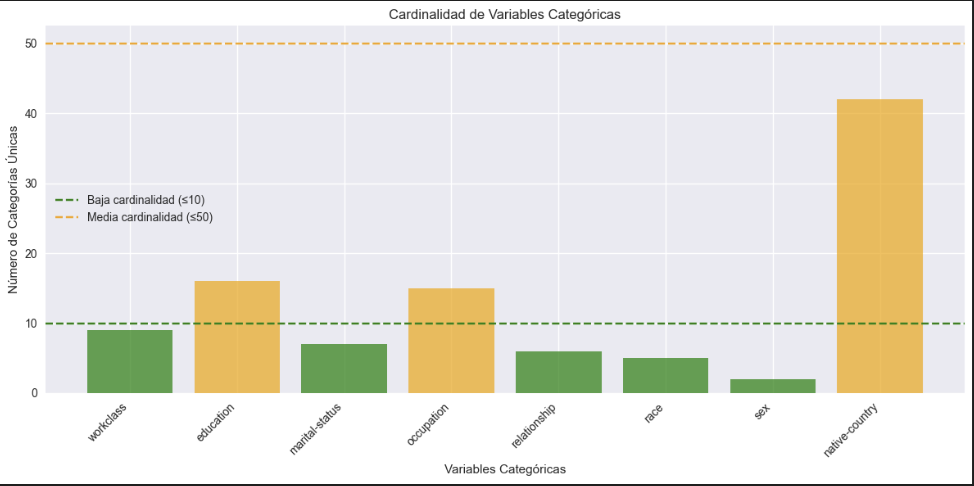
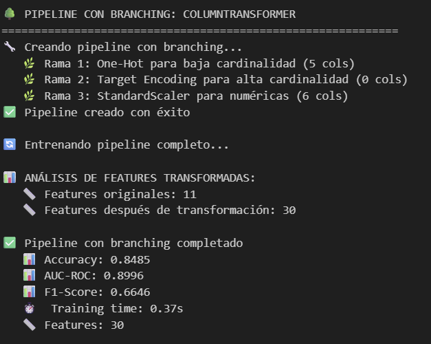
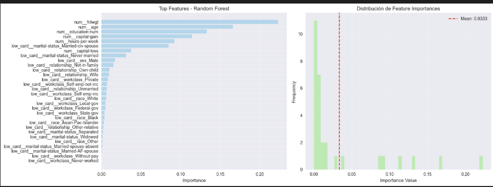
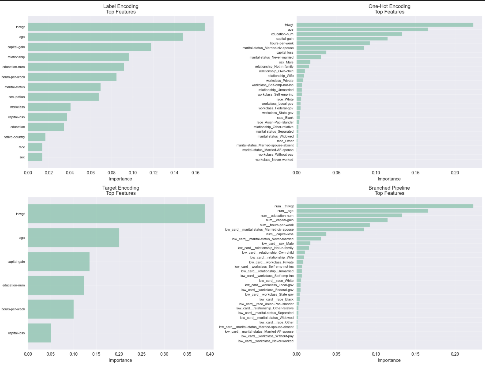

# 09 — Encoding Avanzado y Manejo de Cardinalidad

Comparación sistemática de técnicas de encoding categórico bajo distintas cardinalidades y evaluación de trade-offs (accuracy, AUC, F1, dimensionalidad, tiempo, explicabilidad, riesgo de leakage).

## Contexto
Modelos tabulares con muchas variables categóricas (y cardinalidad alta) sufren alta dimensional si se usan one-hot naive, y pueden perder señal si se codifican con técnicas demasiado simples. Además, la codificación puede introducir leakage si usa información del target del mismo fold.

## Objetivos
- Auditar cardinalidad y distribución de categorías.
- Comparar Label, One-Hot y Target Encoding con diferentes regularizaciones.
- Diseñar un pipeline con ramificación: numéricas (scaler) + categóricas bajas (one-hot) + categóricas altas (target encode con KFold).
- Evitar leakage (target mean por fold; no usar el target del mismo registro).
- Medir desempeño con validación cruzada y explicar impactos.

## Actividades (con tiempos estimados)
- Auditoría de cardinalidad por columna — 15 min
- Implementación de Label, One-Hot y Target Encoding — 35 min
- Construcción de pipeline con ColumnTransformer y KFold TE — 35 min
- Evaluación con CV y comparación de métricas — 25 min
- Documentación de resultados y recomendaciones — 10 min

## Desarrollo
### Métodos de encoding
1) Label Encoding: ordinalización rápida, útil para modelos basados en árboles; riesgo de imponer orden artificial en modelos lineales.
2) One-Hot Encoding: seguro y expresivo para baja cardinalidad; explota dimensionalidad y esparsidad en alta cardinalidad.
3) Target Encoding: reemplaza categoría por media del target con regularización (KFold, smoothing, ruido). Maneja cardinalidad alta, con riesgo de leakage si no se controla.

### Pipeline propuesto
Ramas con `ColumnTransformer`:
- Categóricas de baja cardinalidad → OneHot
- Categóricas de alta cardinalidad → TargetEncoder(KFold=5, smoothing, noise)
- Numéricas → Imputer + Scaler
Modelo: Árboles/GBDT/Regresión lineal regularizada según caso. Validación con StratifiedKFold (clasificación) o KFold (regresión). Evitar fuga usando medias por fold o Leave-One-Out.

### Resultados clave
- One-hot gana en categorías con cardinalidad baja y separación clara.
- Target encoding domina en alta cardinalidad con smoothing y KFold bien calibrados.
- Mezclar OHE (baja) + TE (alta) equilibra señal y dimensionalidad.

## Evidencias
{ width="420" }
{ width="420" }
{ width="420" }
{ width="420" }
{ width="420" }

## Reflexión
El target encoding resulta especialmente valioso cuando enfrentamos alta cardinalidad con suficiente soporte por categoría, siempre que se controle estrictamente el leakage mediante esquemas por fold o leave-one-out con smoothing. Los errores más frecuentes provienen de calcular medias con todo el dataset o de introducir información del mismo registro, lo cual infla artificialmente las métricas. Una estrategia híbrida suele brindar el mejor equilibrio: one-hot para categorías de baja cardinalidad y target encoding regularizado para las de alta, manteniendo el tamaño del espacio de características a raya sin perder señal. Finalmente, los modelos lineales son más susceptibles a sesgos derivados de codificaciones con orden implícito, mientras que los modelos basados en árboles toleran mejor codificaciones ordinales simples.

## Referencias
- category_encoders (TargetEncoder, James-Stein, LeaveOneOut)
- scikit-learn (OneHotEncoder, OrdinalEncoder, ColumnTransformer)
- Micci-Barreca (2001) — A Preprocessing Scheme for High-Cardinality Categorical Attributes.
