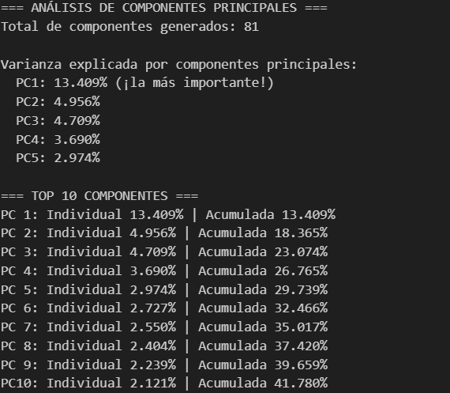
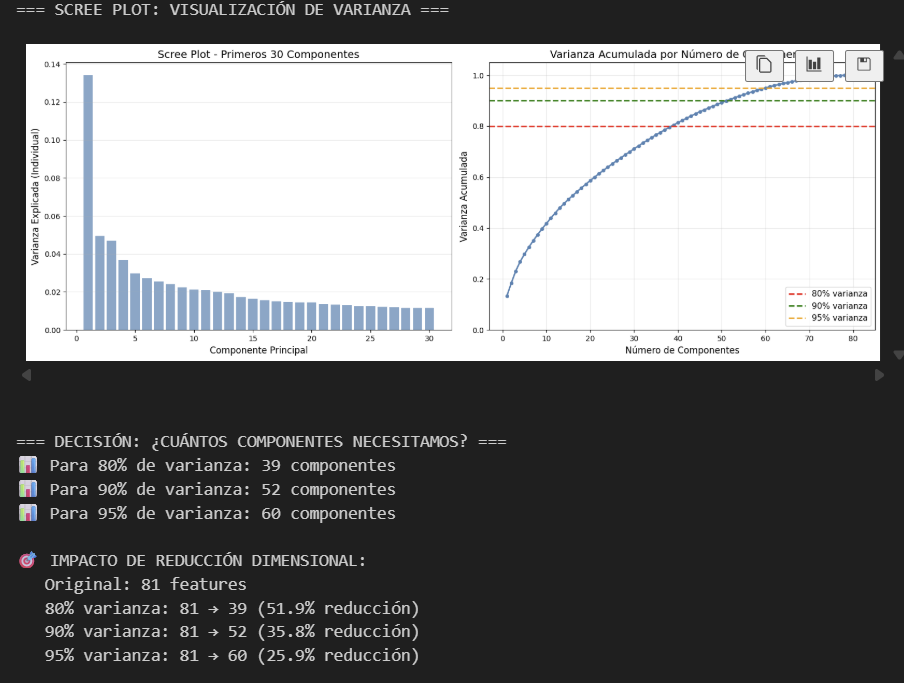
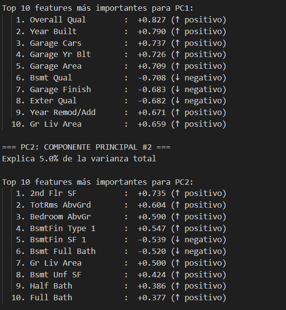
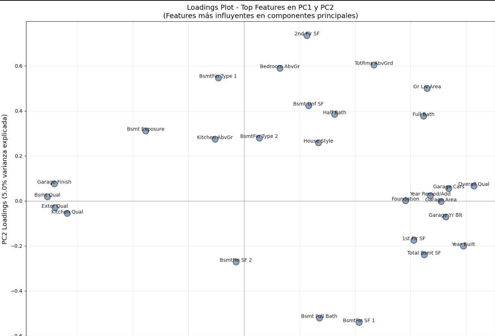
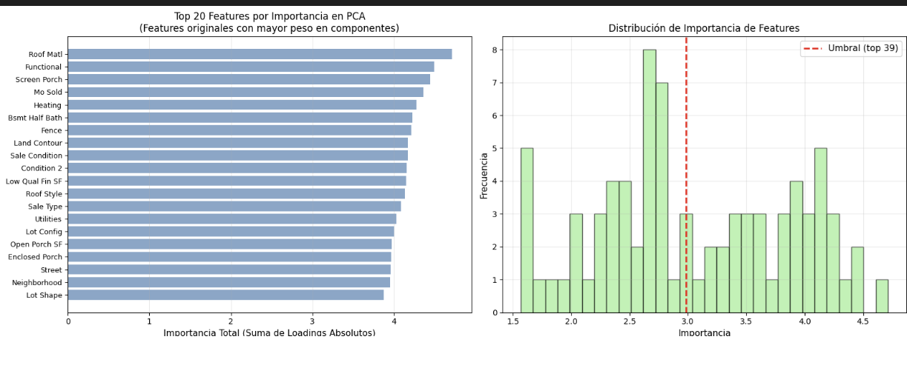
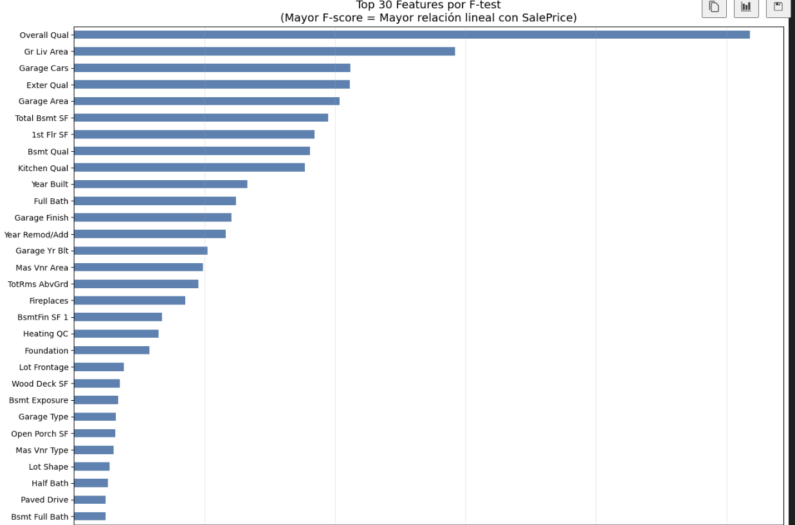

# 10 — PCA y Feature Selection (Ames Housing)

Análisis de reducción dimensional con PCA y selección de variables, y su impacto en estabilidad, interpretabilidad y desempeño.

## Contexto
Modelos con muchas variables numéricas y colinealidad (como Ames Housing) se benefician de reducción dimensional (PCA) y selección de variables (filter/wrapper/embedded) para mejorar estabilidad, interpretabilidad y, a veces, desempeño.

## Objetivos
- Aplicar PCA con escalado apropiado, analizar varianza explicada y seleccionar número de componentes.
- Inspeccionar loadings para entender qué variables dominan cada componente.
- Comparar selección de features: Filter (correlación, mutual information).
- Medir impacto en métrica (RMSE/R²) y complejidad del modelo.

## Actividades (con tiempos estimados)
- Preparación de datos y escalado — 15 min
- PCA: ajuste, scree plot y varianza acumulada — 30 min
- Interpretación de loadings y biplot — 20 min
- Selección de features: Filter, RFE, Embedded — 40 min
- Evaluación de métricas vs. k componentes/features — 25 min

## Desarrollo
### PCA: flujo de trabajo
1) Escalar numéricas (StandardScaler).
2) Scree plot y varianza acumulada para elegir k.
3) Biplot/loadings para interpretar componentes dominantes.

### Comparativa y métricas
- Varias configuraciones (k componentes o k features) y evaluar RMSE/R² vía CV.
- Curvas de desempeño vs. k para elegir punto de equilibrio bias-variance.
- Estabilidad de selección: ¿qué variables aparecen consistentemente?

## Evidencias
{ width="420" }
{ width="420" }
{ width="420" }
{ width="420" }
{ width="420" }
{ width="420" }
## Reflexión
PCA demostró ser útil para reducir colinealidad y estabilizar modelos lineales, aunque implica sacrificar interpretabilidad directa, por eso se complementó con el análisis de loadings para entender qué variables dominan cada componente. En selección de variables, el enfoque que mejor equilibró velocidad, robustez e interpretabilidad fue combinar un filtrado rápido (correlación o MI) con un método embebido como Lasso o Random Forest, reservando los wrappers como etapa final cuando el espacio ya está acotado. El principal trade-off apareció al forzar demasiada reducción: se pierde señal y el desempeño puede degradarse. En ese sentido, la selección mantiene una explicación más directa del fenómeno, mientras que PCA exige pasos adicionales de interpretación.

## Referencias
- Scikit-learn — PCA: https://scikit-learn.org/stable/modules/generated/sklearn.decomposition.PCA.html
- Scikit-learn — SelectKBest: https://scikit-learn.org/stable/modules/generated/sklearn.feature_selection.SelectKBest.html
- Scikit-learn — RFE (Recursive Feature Elimination): https://scikit-learn.org/stable/modules/generated/sklearn.feature_selection.RFE.html
- Scikit-learn — RandomForestRegressor: https://scikit-learn.org/stable/modules/generated/sklearn.ensemble.RandomForestRegressor.html
- Tutorial PCA (scikit-learn example): https://scikit-learn.org/stable/auto_examples/decomposition/plot_pca_iris.html
- Ames Housing (competencia Kaggle): https://www.kaggle.com/c/house-prices-advanced-regression-techniques
