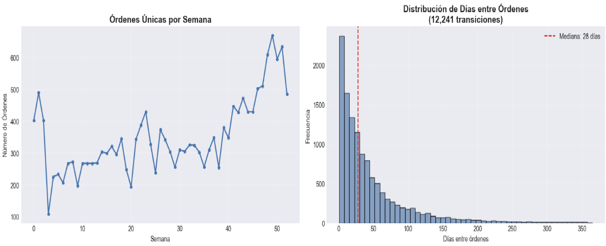
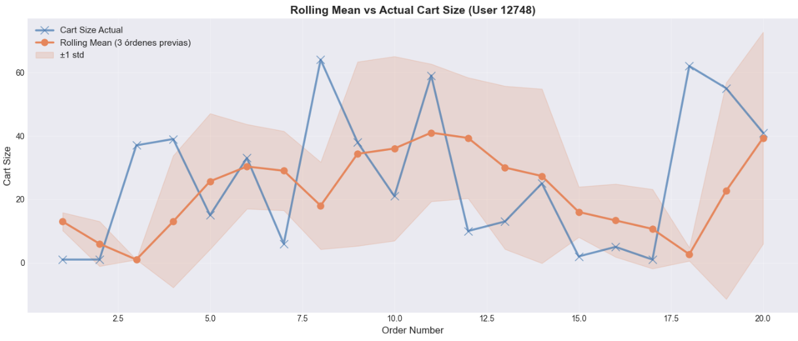
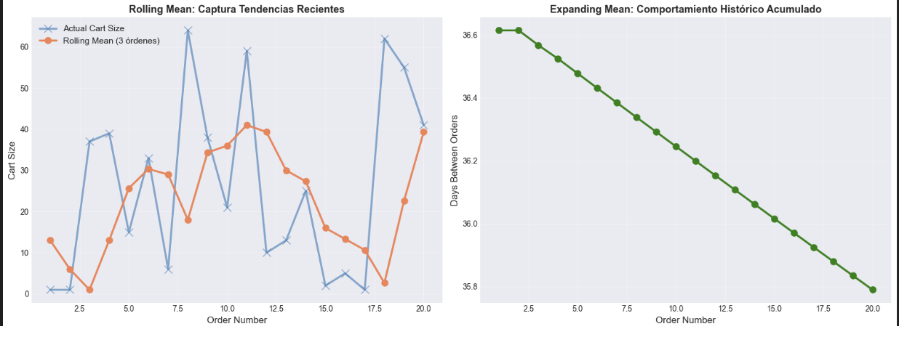
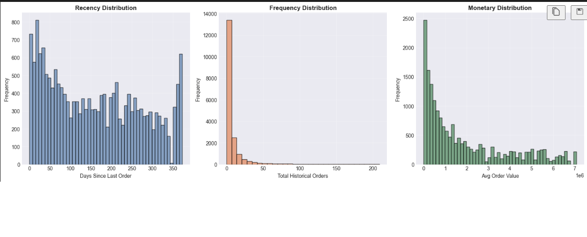
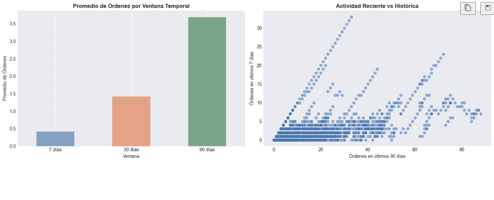

# 11 — Temporal Feature Engineering con Pandas (Online Retail)

Construcción de features temporales y comportamiento histórico de usuarios para predecir probabilidad de recompra evitando data leakage.

 

## Contexto
Un e-commerce con histórico de transacciones por cliente necesita mejorar su modelo de propensión de compra futura. Las variables crudas (importe, fecha, categoría) no capturan bien recencia, frecuencia, patrones estacionales y tendencias individuales.

## Objetivos
- Construir features temporales robustas: lags, ventanas móviles, contadores, RFM, indicadores estacionales.
- Evitar leakage (no usar información futura de la serie en la observación actual).
- Implementar validación temporal (time-based split) en lugar de KFold aleatorio.
- Medir impacto incremental: baseline vs + temporal features.

## Actividades (con tiempos estimados)
- Preparación y orden temporal de transacciones — 15 min
- Generación de lags y ventanas (rolling, expanding) — 40 min
- Cálculo de RFM y calendario estacional — 30 min
- Integración y validación temporal (train pasado → valid futuro) — 25 min
- Evaluación de métricas y análisis de importancia — 20 min

## Desarrollo
### Familias de features temporales
1) Recencia/Frecuencia/Monetización (RFM): días desde última compra, cantidad de pedidos últimos N días, gasto acumulado.
2) Lags: importe_lag_1, importe_lag_2, etc., para capturar persistencia.
3) Ventanas móviles: rolling_mean_7d, rolling_sum_30d.
4) Ventanas expandibles (cumsum): gasto_total_historico.
5) Estacionales/calendario: mes, día_semana, festivo, quarter.
6) Trend y momentum: diferencia importe vs promedio móvil, ratio última compra vs media previa.
7) Ratios adaptativos: frecuencia_normalizada = frecuencia_30d / media_frecuencia_cliente.

### Checklist anti-leakage temporal
- Ordenar por tiempo antes de generar features.
- Usar shift para lags (no mirar hacia adelante).
- Rolling con `closed='left'` para excluir el punto actual.
- Splits temporales (train pasado → valid futuro).
- No recalcular estadísticas globales usando datos de validación.

### Pipeline temporal simplificado
Ordenar → Agrupar por cliente → Generar lags/rolling (shift seguro) → Calcular RFM → Añadir calendario → Validación temporal.

### Métricas y evaluación
- Baseline (crudo) vs enriquecido con features temporales.
- Métrica esperada: mejora en AUC/ROC (clasificación) o reducción RMSE (regresión de importe futuro).
- Importancia: lags recientes y recencia tienden a dominar.

## Evidencias
{ width="420" }
{ width="420" }
{ width="420" }
{ width="420" }
{ width="420" }

## Reflexión
Entre las señales más determinantes aparecieron la recencia de compra y los agregados recientes (por ejemplo, el rolling_sum_30d), que capturan bien la inercia del comportamiento. El mayor riesgo estuvo en el leakage temporal: cualquier cálculo que mira hacia el futuro distorsiona las métricas, por lo que el uso disciplinado de shift, ventanas que excluyen el punto actual y splits por tiempo resultó crítico. En términos operativos, el costo computacional crece con la cantidad de ventanas y la granularidad temporal, por lo que conviene priorizar las que aportan mayor señal. Finalmente, los clientes con poca historia presentan sparsity en lags largos; estrategias de imputación o ventanas adaptativas ayudan a mitigar esta limitación sin introducir sesgos.

## Referencias
- Pandas: shift, rolling, groupby.
- Featuretools / tsfresh para extracción automática (evaluar trade-off).
- Artículos de churn y CLV (customer lifetime value) para RFM.
- Pandas timeseries docs.
- TimeSeriesSplit (scikit-learn) buenas prácticas.
- Seasonal decomposition (statsmodels) para estacionalidad avanzada.
- MLFinLab (validaciones purged, leakage advanced).

