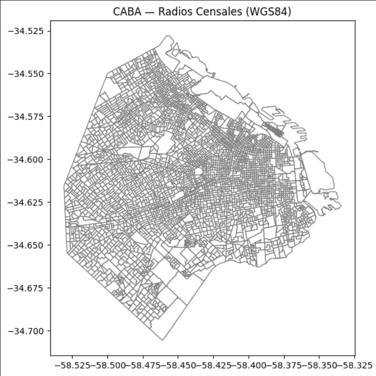
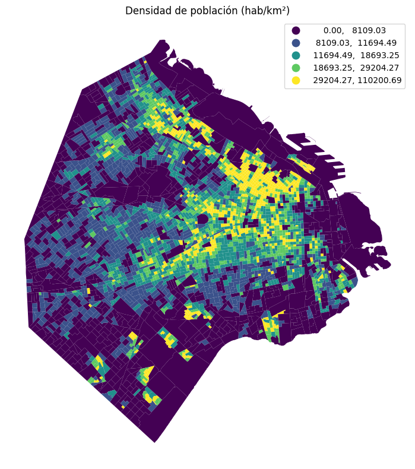
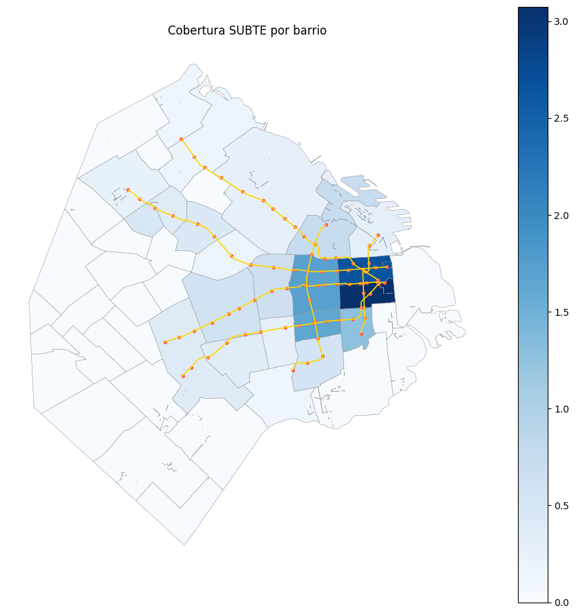
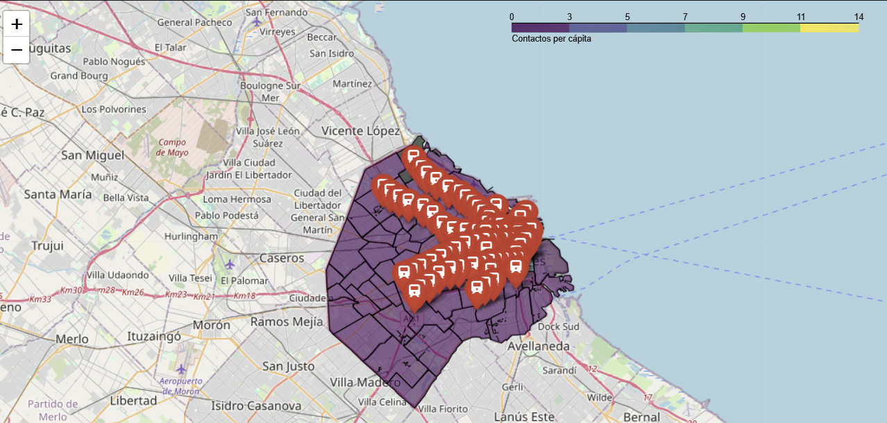

# 12 — Geoespacial con GeoPandas

Implementación de un pipeline geoespacial de punta a punta utilizando GeoPandas y Shapely para carga, validación, joins espaciales y visualización sobre la Ciudad Autónoma de Buenos Aires (CABA).

## Contexto
El análisis de datos georreferenciados es fundamental para comprender patrones urbanos. En este caso, trabajamos con datos de la Ciudad de Buenos Aires (radios censales, estaciones de subte, líneas) para analizar densidad poblacional y cobertura de transporte, enfrentando desafíos como sistemas de coordenadas (CRS) y operaciones geométricas.

## Objetivos
- Implementar carga y validación de CRS con GeoPandas.
- Realizar normalizaciones espaciales (densidad por km²).
- Ejecutar joins espaciales (puntos en polígonos, nearest neighbors).
- Visualizar resultados mediante mapas estáticos (Matplotlib) e interactivos (Folium).

## Actividades (con tiempos estimados)
- Setup y carga de polígonos de radios censales — 20 min
- Estandarización de CRS y cálculo de áreas — 20 min
- Visualización básica (Coropletas) y Contextily — 30 min
- Attribute Join con datos de atención ciudadana — 25 min
- Joins espaciales (Estaciones de Subte vs Barrios) — 30 min
- Visualización interactiva con Folium — 25 min

## Desarrollo
### 1. Carga y Proyección (CRS)
Se cargaron los radios censales de CABA desde GeoJSON. Un paso crítico fue la reproyección de WGS84 (geográfico) a un CRS proyectado en metros (EPSG:3857 o similar) para calcular áreas correctamente.
`radios_m = radios.to_crs(epsg=3857)`

### 2. Métricas de Densidad
Calculamos el área de cada radio en metros cuadrados para obtener la densidad de población:
`densidad = POBLACION / (area_m2 / 1e6)` (hab/km²).

### 3. Joins Espaciales (Spatial Joins)
Utilizamos `gpd.sjoin` para vincular estaciones de subte con los barrios a los que pertenecen. Esto permitió contar la cantidad de estaciones por barrio y calcular densidades de cobertura de transporte.
También exploramos `sjoin_nearest` para encontrar la distancia mínima de cada barrio a una estación de subte, identificando zonas con menor cobertura.

### 4. Visualización
- Estática: Mapas de coropletas usando esquemas como Quantiles para visualizar la densidad poblacional.
- Capas: Superposición de líneas de subte y estaciones sobre el mapa base de barrios.
- Interactiva: Uso de `Folium` para crear mapas navegables con popups informativos.

## Evidencias
{ width="420" }
{ width="420" }
{ width="420" }
{ width="420" }

## Reflexión
El manejo correcto de las proyecciones (CRS) es el error más común y crítico en análisis espacial; confundir grados con metros invalida cualquier cálculo de distancia o área. Las uniones espaciales resultaron ser una herramienta poderosa para integrar datasets que no comparten una clave (ID) común pero sí comparten el espacio geográfico. La visualización interactiva aporta un valor significativo para la exploración de datos granulares como los radios censales.

## Referencias
- GeoPandas User Guide.
- Shapely documentation.
- Contextily providers.
- Folium documentation.

