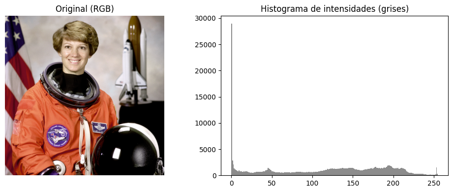
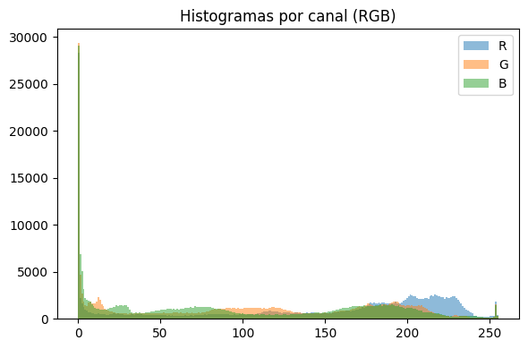
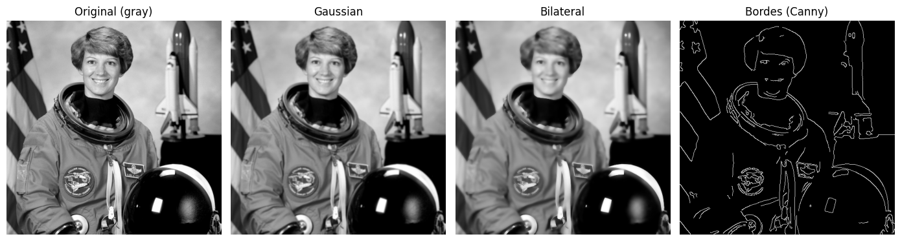

# 13 — Preprocesamiento de Imágenes

Pipeline de preprocesamiento de imágenes abarcando representación, espacios de color, ajuste de contraste, suavizado y detección de características para visión por computadora.

## Contexto
Antes de aplicar modelos complejos de Computer Vision, las imágenes requieren tratamiento para resaltar características relevantes y normalizar variaciones de iluminación o ruido. Trabajamos con imágenes estándar (Lena, Astronaut, Camera) para aplicar técnicas fundamentales de procesamiento digital.

## Objetivos
- Comprender y manipular espacios de color (RGB, HSV, Gray).
- Mejorar el contraste mediante técnicas globales y adaptativas (CLAHE).
- Aplicar filtros de suavizado y detección de bordes.
- Detectar puntos de interés (Keypoints) con descriptores como ORB.

## Actividades (con tiempos estimados)
- Carga y exploración de metadatos de imagen — 15 min
- Conversión de espacios de color y análisis de histogramas — 25 min
- Ajuste de contraste (Ecualización vs CLAHE) — 30 min
- Aplicación de filtros (Gaussian Blur) y bordes (Canny) — 30 min
- Detección de features (Harris/ORB) y visualización — 30 min

## Desarrollo
### 1. Espacios de Color
Las imágenes se cargaron inicialmente en BGR (OpenCV default) y se convirtieron a RGB y Grayscale. Exploramos el espacio HSV para separar la información de color (Hue) de la iluminación (Value), útil para segmentación.

### 2. Contraste y Ecualización
Comparamos la ecualización de histograma global (que puede saturar ruido) contra CLAHE (Contrast Limited Adaptive Histogram Equalization), que mejora el contraste localmente preservando detalles.

### 3. Filtros y Bordes
Aplicamos suavizado Gaussiano para reducir ruido antes de la detección de bordes. Utilizamos el algoritmo de Canny para encontrar contornos estructurales en la imagen, ajustando los umbrales de histéresis.

### 4. Extracción de Características
Implementamos detectores de puntos de interés. Usamos ORB (Oriented FAST and Rotated BRIEF) como una alternativa eficiente a SIFT/SURF para detectar esquinas y texturas distintivas, visualizando los keypoints sobre la imagen original.

## Evidencias
{ width="420" }
{ width="420" }
{ width="420" }

## Reflexión
El preprocesamiento no es paso único sino iterativo. La elección del espacio de color correcto simplifica tareas de segmentación, mientras que el contraste adaptativo (CLAHE) suele ser superior a la ecualización global en imágenes con iluminación irregular. La detección de bordes y keypoints depende fuertemente de la calidad de la imagen previa, haciendo vitales los pasos de reducción de ruido.

## Referencias
- OpenCV Documentation (Imgproc).
- Scikit-image User Guide.
- Teoría de Espacios de Color (RGB vs HSV vs LAB).
- Algoritmo Canny Edge Detection.

