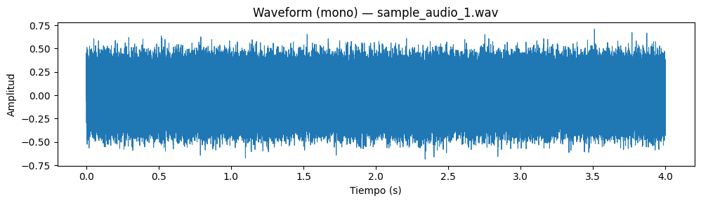
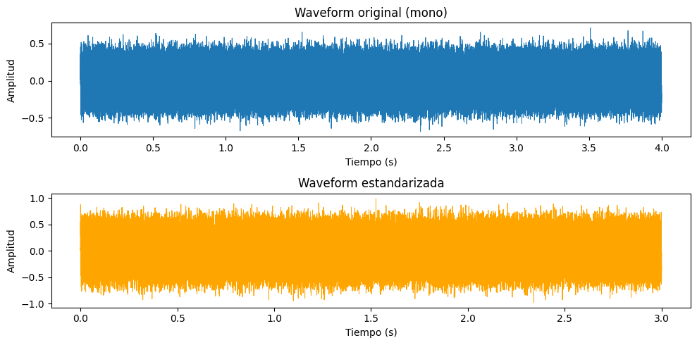
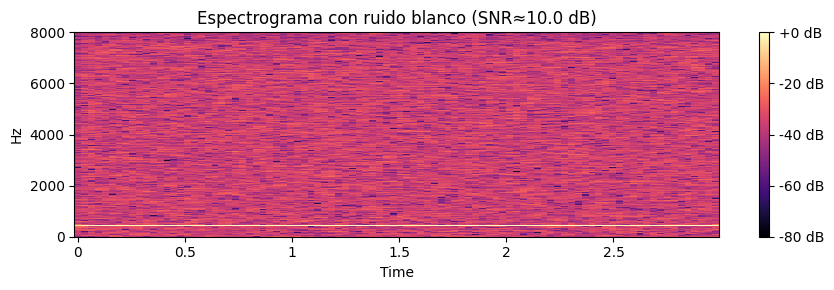
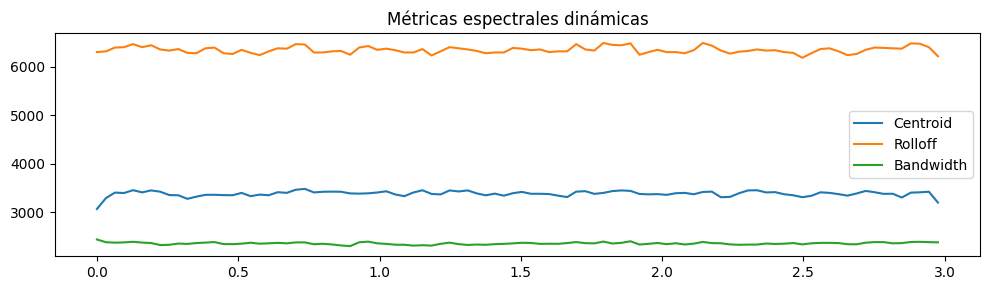

# 14 — Procesamiento de Audio como Datos

Diseño e implementación de un pipeline de procesamiento de audio: carga, inspección espectral, limpieza y extracción de características (MFCC) para Machine Learning.

## Contexto
El audio es una señal temporal compleja. Para utilizarlo en modelos de ML, debemos transformarlo de su representación en el dominio del tiempo a representaciones en frecuencia o tiempo-frecuencia que capturen patrones perceptuales.

## Objetivos
- Cargar y manipular archivos de audio con Librosa.
- Visualizar formas de onda y espectrogramas.
- Entender la transformación al dominio de la frecuencia (FFT, STFT).
- Extraer características avanzadas como MFCCs (Mel-frequency cepstral coefficients).

## Actividades (con tiempos estimados)
- Carga de audio y visualización de onda temporal — 20 min
- Análisis espectral (Fourier, Espectrograma de Mel) — 30 min
- Limpieza y normalización de amplitud — 20 min
- Extracción de MFCCs y Delta features — 30 min
- Preparación de dataset tabular para clasificación — 20 min

## Desarrollo
### 1. Representación Temporal
Utilizando `librosa`, cargamos audios y visualizamos la amplitud en el tiempo (`waveshow`). Observamos la tasa de muestreo (sample rate) y la duración.

### 2. Dominio de la Frecuencia
Aplicamos la Transformada de Fourier de Tiempo Corto (STFT) para obtener el espectrograma, visualizando cómo varía la intensidad de las frecuencias a lo largo del tiempo. Convertimos la escala de frecuencia a Mel para imitar la percepción auditiva humana.

### 3. Extracción de Features (MFCC)
Calculamos los MFCCs (Mel-frequency cepstral coefficients), que son la representación estándar para reconocimiento de voz y clasificación de audio. Estos coeficientes resumen la forma envolvente del espectro de potencia.

### 4. Pipeline de Datos
Estandarizamos los clips de audio (misma duración/padding) y generamos un DataFrame donde cada fila es un audio y las columnas son los promedios de sus MFCCs, listo para entrenar un clasificador.

## Evidencias
{ width="420" }
{ width="420" }
{ width="420" }
{ width="420" }

## Reflexión
El tratamiento de audio comparte similitudes con series temporales, pero requiere transformaciones específicas (STFT, Mel) para extraer información útil. Los MFCCs logran comprimir gran cantidad de información espectral en pocos coeficientes (típicamente 13-20), siendo muy eficientes para modelos clásicos. La normalización de volumen es crítica para que el modelo no sesgue por la intensidad de la grabación.

## Referencias
- Librosa documentation.
- Fast Fourier Transform (FFT) theory.
- Mel Scale & Cepstral Analysis.

